# Person-in-Place GUI platform Release!

We created the 'gradio_HOI_skt.py' based on the bbox selection code in the issue at [here](https://github.com/gradio-app/gradio/issues/2316), and we express infinite gratitude to 'joytsay', who provided us with the code!  
We created 'gradio_HOI_image_editing.py' and utilized ControlNet inpainting as a GUI tailored to our task.  
The GUI for direct user editing of the skeleton will be update soon!

## Installation
If you want to use 'Make object interactive Skeleton Toolkit' or 'Make HOI image editing Toolkit,' you need to install the latest version of Gradio, which is version 4.7.1. [here](https://www.gradio.app/)  

## Run
### Make object Interactive Skeleton Toolkit
If you are running 'Make object Interactive Skeleton Toolkit' you should proceed with the conda virtual environment named HOI_skt, and you can execute the following code:
```
conda activate HOI_skt
python gradio_HOI_skt.py
```

### Make HOI image editing Toolkit
If you are running 'Make HOI image editing Toolkit' you should proceed with the conda virtual environment named HOI_skt, and you can execute the following code:
```
conda activate HOI_editing_cont
python gradio_HOI_skt.py
```

## Make Object interactive Skeleton Toolkit

Our GUI Toolkit allows users to interactively select person bounding boxes and object bounding boxes to obtain corresponding skeletons.  
The following GIF provides an example of generating an interactive skeleton for the demo.  

 

### The usage guide for the Person-in-Place Object Interactive Generated Skeleton GUI.

#### Step 1. Upload Image
Drag and drop the image file onto the input, or use the upload tool below to upload an image


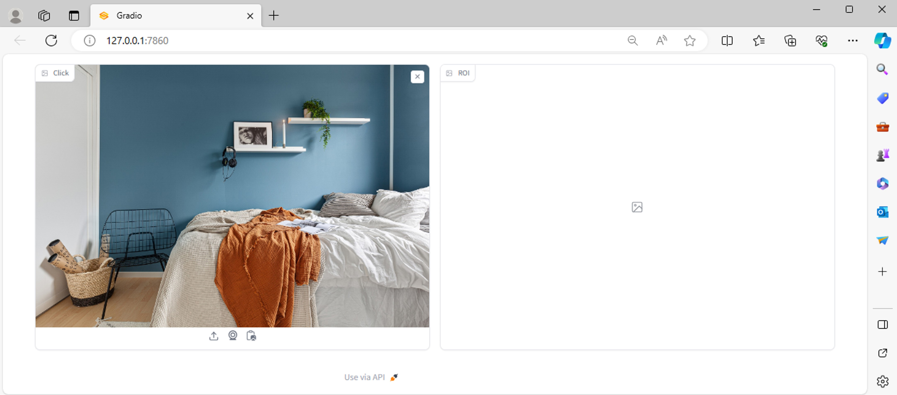 

#### Step 2. Clicked Start Coordinate (for person bounding box)
When you click on a coordinate once, as shown in the left image, the label 'select of Person BBOX' will appear on the right image.  
This indicates the selected coordinate, and based on this, proceed to select the next coordinates to define the Person

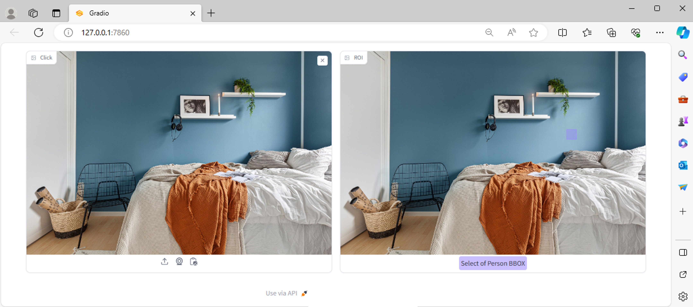 

#### Step 3. Clicked End Coordinate (for person bounding box)

When you click the image once more, a person bounding box will appear based on the coordinates you first clicked, and this will be designated as the person bounding box.  
The next step is to select the object bounding box.

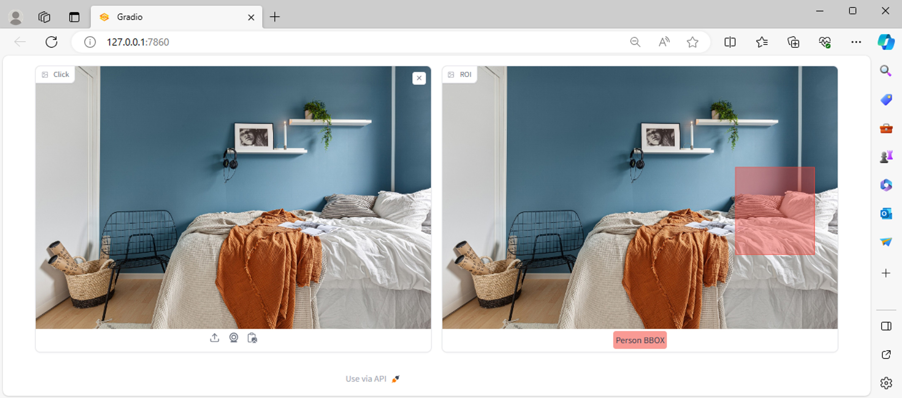 

#### Step 4. Clicked Start Coordinate (for object bounding box)
Similar to Step 2, when you select the start coordinate for the object bounding box, an icon labeled 'select of Object BBOX' will appear on the right image.  
This signifies the starting point of the object bounding box

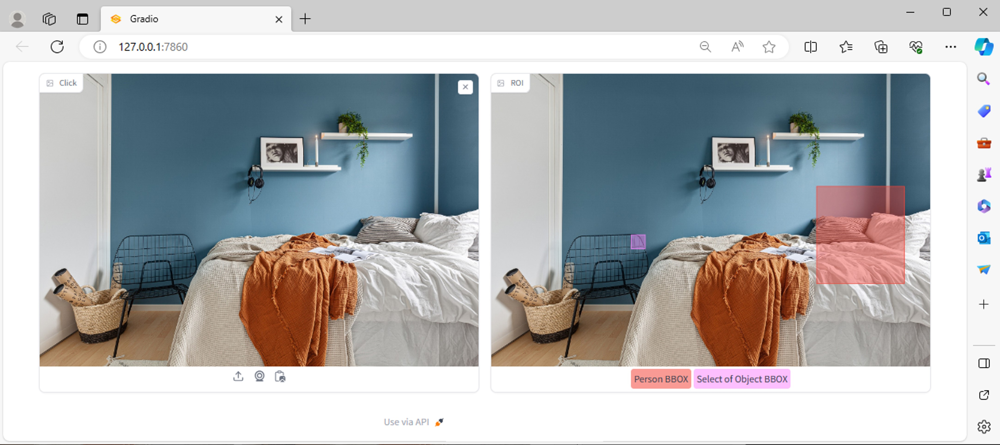 

#### Step 5. Clicked End Coordinate (for object bounding box)
As the final step, when you select the end coordinate of the Object BBOX, the object bounding box is defined and labeled as 'Object BBOX.'  
Through our approach of using Associative Attention in our model, based on the user-selected Person BBOX and Object BBOX, an Object Interactive Skeleton is generated.  
This can be visualized in the right image.

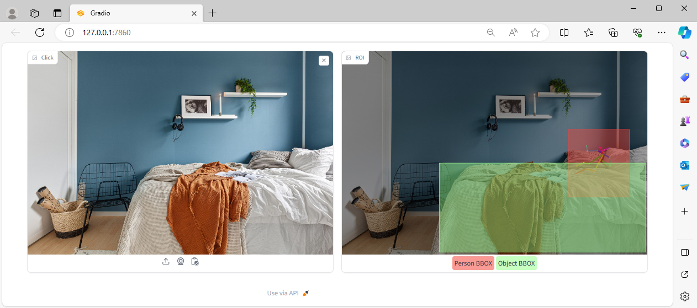 

## Make HOI image editing Toolkit

When using our HOI image editing GUI, you can proceed with editing using a predefined skeleton guidance map.  
The predefined skeleton guidance map can be created using the make object interactive skeleton GUI used earlier or the demo and tutorial code we provided.  

The following GIF was created for demonstration purposes, and you can see how easy it is to use.

 

### The usage guide for the Person-in-Place HOI image editing GUI toolkit.

#### Step 1. Upload Target Image & predefined skeleton guidance map

You can prepare for editing by dragging and dropping images onto the Input Background Image and Guidance Image, or by uploading them.

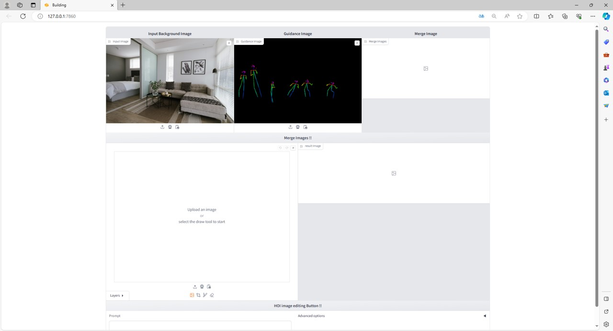 

#### Step 2. Merge Images

As the next step, you need to merge the images.  
Merging the image involves combining the background image with the guidance image. This process is done to facilitate easier masking.  
Once you press this button, a merged image will be generated as shown below. You can download it for further use.

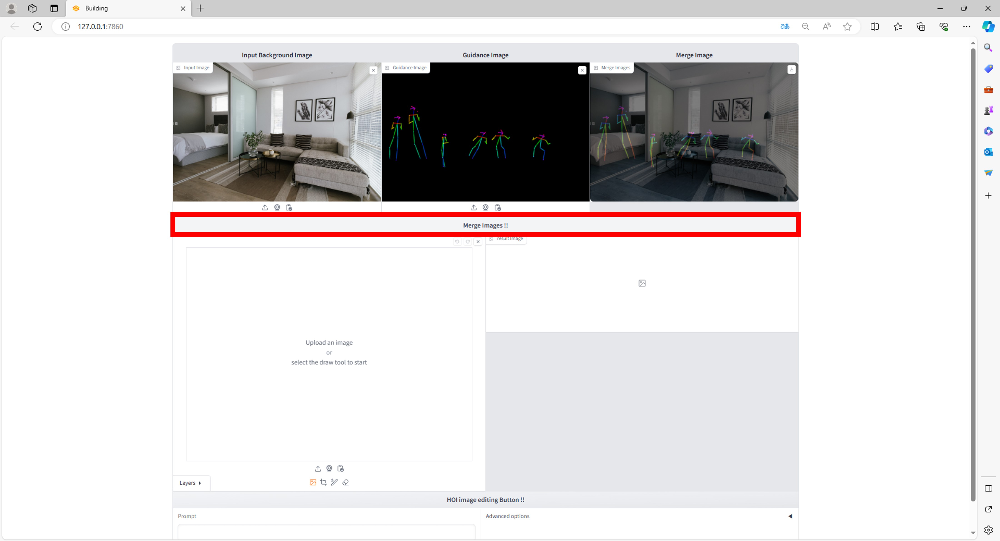 

#### Step 3. Upload Merge Images for masking

Next, you need to upload the downloaded merged image for masking processing.

You can either click on the area marked with a red bounding box or drag and drop the image to initiate the upload.

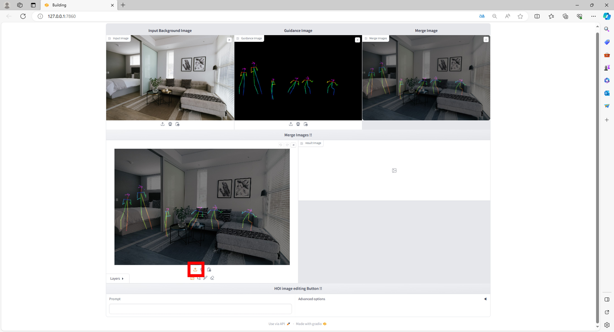

#### Step 4. Masking images

Next, you need to click on the red box to perform image masking.  
The uploaded image is used solely for masking purposes and is not used in the actual HOI image editing process.  
After that, input a suitable prompt in the blue box according to your preferences, and the corresponding HOI image editing will be carried out.

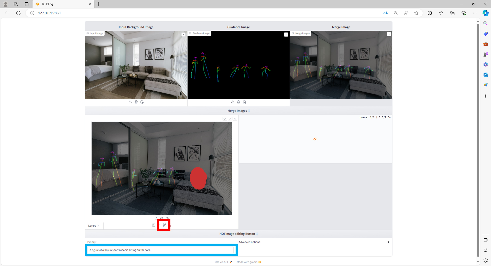

#### Step 5. Enjoy !

Looking at the result image, you can see that it is functioning well as shown below.

Moreover, the exciting fact is that editing is possible exclusively for the person I want to create!

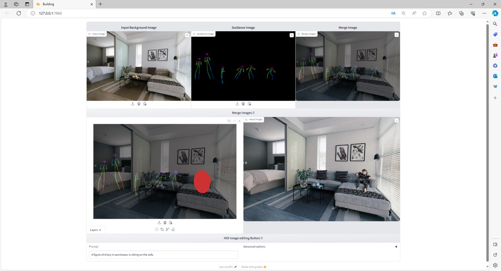

If you perform masking for the person or people you want to create, as shown in the image below, the process will be applied to all of those individuals at once.

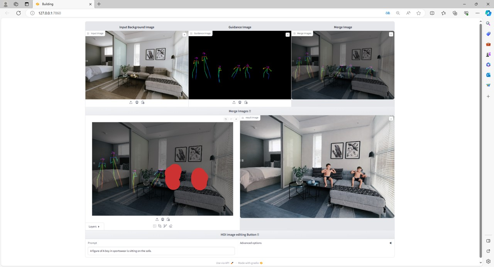