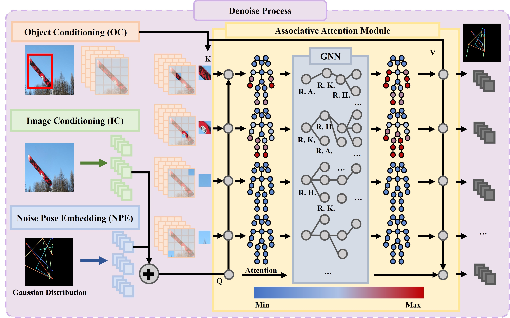
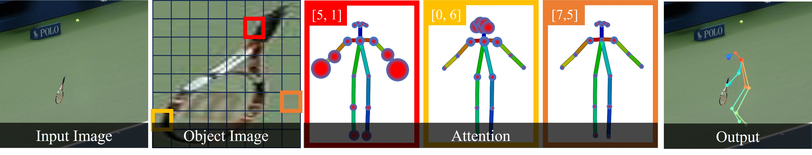
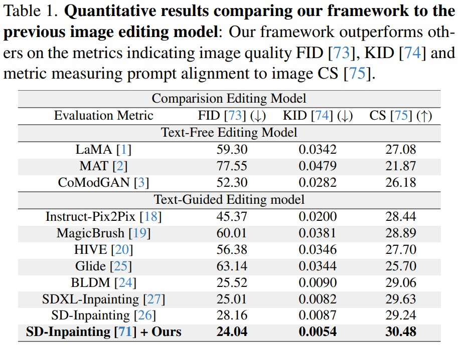
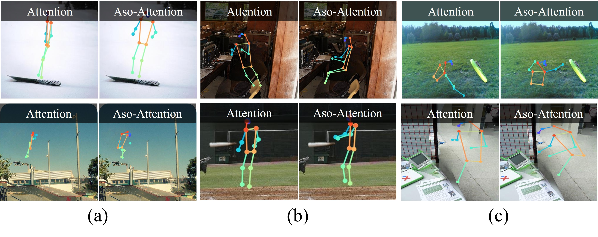

# CVPR2024_Person-In-Place_RELEASE

## Upcoming Updates

* The current version is V 1.0 and we will continue to update it.
* We plan to add more and more applications, so please stay tuned!
* Main Paper: Will be re-uploaded after finalizing the camera-ready revisions.
* Project Page: https://anonymous.4open.science/w/Person-in-Place_page-67F1/


Human-object interaction (HOI) image editing using generated skeleton: We synthesize human interacting with objects for
an initial image using the automated object-interactive diffuser. 

(a) an initial image to edit.  
(b) the sequential process of synthesizing human image with object-interactive skeletons using textual conditions.  
(c) a final result image with the skeleton map.  
Our method generates the
high quality object interactive skeleton map, and it can easily plug in to the skeleton guided generative model for HOI image editing

## Our Frameworks
Overview of proposed framework: Our proposed framework uses a cropped image from a person bounding box as an input and the object bounding box.  
(Left) These are used to extract a image and an object features.  
(Middle) The extracted features are used as a image and object conditioning respectively in our object interactive diffuser.  
Using these conditionings, the object interactive diffuser comes to see the object-joint and joint-joint relationships then generate a denoised skeleton based on diffusion process.  
(Right) The synthesized skeleton together with a masked image using a person bounding box is used to edit image with off the shelf inpainting model.


## Our Proposed Method
The denoise process first estimate the correlation between the object and the joints, and then it considers the relationship between the joint themselves using a GNN.  
After that, the object conditioning is used to predict which joints are most likely to interact with the object.  

In this figure, the pixels located inside the snowboard have higher attention score on joints such as hands or foot than others.


This figure visualizes which joint has the greatest association with features correspond to selected pixels in the image colored red, yellow and orange.  
The size of the circle indicates the degree of association.  



## Thank you for providing a Code
It expresses gratitude to a contributor who provided two codes, one for [ControlNet-Inpainting](https://github.com/mikonvergence/ControlNetInpaint) and one for [D3DP](https://github.com/paTRICK-swk/D3DP).


## Experimental Results
  





### more qualititave results is [here](./assets/add_results/readme.md)

## Installation
* Make object interaction skeleton

We recommend you to use an [Anaconda](https://www.anaconda.com/) virtual environment. Install PyTorch >=1.6.0 and Python >= 3.7.3.  
All this toolkit is on `requirements.sh` [here](./requirements.sh).  
Then, run `sh requirements.sh`.

* Make inpainting image

```
conda env create -f environment.yaml
conda activate HOI_editing_cont
```

# Quick Demo & Tutorial Code & GUI
## Our GUI platform (based on gradio)

Check [here](./GUI/README.md)!

### Make Object interactive Skeleton Toolkit

 

### Make HOI image editing Toolkit

 


### Preparing Demo & Tutorial
* Download the Our framework pth file & demo Code [here](https://drive.google.com/drive/folders/16phJCCQ5-Xz3LFDMh5cpUrKXaBU3M4VC?usp=sharing) and unzip it under `${ROOT}/demo/` & `${ROOT}/output/SOTA`. 

The next step is to check here and run the [demo](./demo/readme.md)!

## Tutorial
Check [here](./demo/readme.md)!  

The experiments comparing SD-inpainting and SDXL-inpainting in both the tutorial and the main paper for our model are also included!  
Enjoy to your heart's content!
### Make HOI image editing Tutorial
#### Real Image - high resolution

  

#### Test Image - Our Dataset

  

### Make Object interactive Skeleton Tutorial
#### Real Image - high resolution

  

#### Test Image - Our Dataset

  


# Testing Object-Interaction Skeleton
Download [here](https://drive.google.com/file/d/1l-giuZKG28X5VXlIZYC7dquwTGPdEVW5/view?usp=sharing) and you can check our dataset (based-on V-COCO)  

and testing code (On object interaction skeleton enviroments)
```
python test.py --gpu $n --cfg ../assets/yaml/v-coco_diffusion_image_feature.yml --exp_dir ../output/{exp_dir} --test_epoch $n_epoch
```

if you check n-top accuracy change `v-coco_diffusion_image_feature.yml`
```
obj_bbox_factor => 1
bbox_factor_param => 8
```
and same code (On object interaction skeleton enviroments)
```
python test.py --gpu $n --cfg ../assets/yaml/v-coco_diffusion_image_feature.yml --exp_dir ../output/{exp_dir} --test_epoch $n_epoch
```


# Application

We plan to upload application tools in the future
