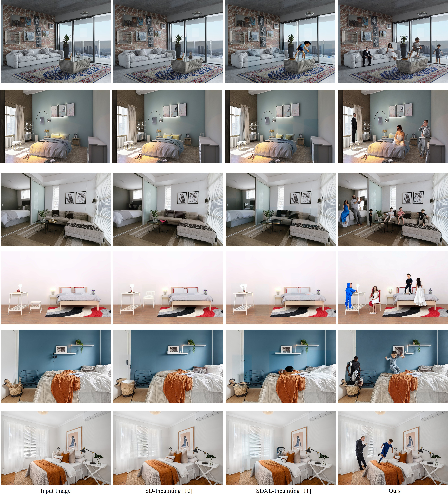
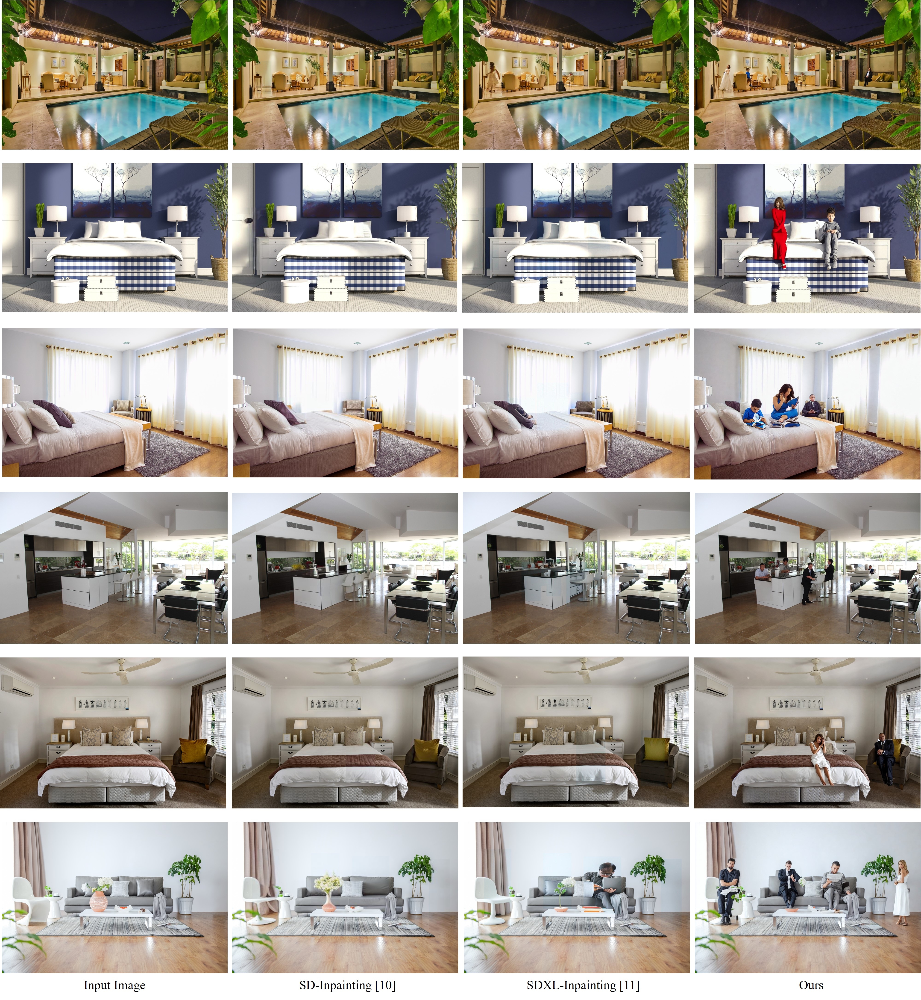

# Person-in-Place Additional Results

## experimental results : Associative Attention
The results presented below illustrate the distinctions in visualization between associative attention and a conventional attention mechanism.  
Associative attention demonstrates superior interaction with objects compared to the general attention mechanism, and it is evident that the overall skeletal structure emerges organically.  
Moreover, more natural outcomes are achieved as a natural skeletal structure is extracted through propagation within the GNN (Graph Neural Network) network for each joint.

## experimental results : Our Dataset Results
The following results display the outcomes for our framework alongside common editing models (CoModGAN, Pix2Pix, SD-Inpainting).  
Our framework exhibits particular strength in Human-Object Interaction (HOI).  
It is evident that, unlike existing models that struggle with object interaction, our model performs exceptionally well. For instance, it achieves high results in actions involving interaction with objects, such as surfing, lying on the sofa, using the computer, or cutting a cake.

  
  

## experimental results : Multi-Person Results
The presented figure illustrates the outcomes of our model compared to existing models (SD-inpainting, SDXL-inpainting) when generating multi-person images at high resolution.  
Our results demonstrate a clear superiority over other models.  
While existing models tend to concentrate on generating a background that aligns with the entire image when inpainting through a small person bounding box, our model incorporates a conditioning map called a skeleton.  
This enables more effective inpainting of individuals compared to other models.  

  
  
